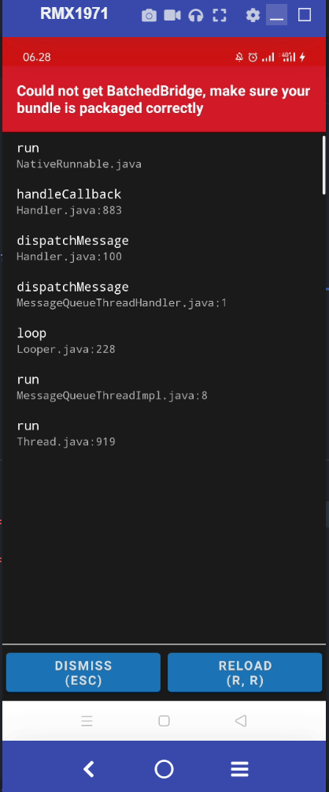

Imagine that you have a React Native Apps, (either pure one or with Expo), you had your phone connected already physically via USB Debugging. When you importing your picture from your app, it shown something like 'bridge error'. For the first timer using Expo React Native (without configuring Tethering from phone connection to private & run expo start --tunnel), it was so frustrating.  
I remember I cried _alot_ from that error.  
It won't shown my app unless I get rid that error by resolving it.



There are Two Solution that I try out:

1. configuring Tethering from phone connection to private & run expo start --tunnel (and set that adb mode)
2. creating helper function to load it as uri from Image Component (react-native)

I have no idea what num 1 was back then, so I decided to SO-ing (StackOverflowing) from dawn time to 8 a.m and see [this link](https://stackoverflow.com/questions/29290460/use-image-with-a-local-file/65338987#65338987).

So,I go with the 2nd one.

Now, how do we do it?

1. Create a `your_name_image_helper`.js file in your helpers folder in img folder innit (for sake of neat folder structure)
2. Fill your `your_name_image_helper`.js file with this syntax :

```js{3}
import { Image } from 'react-native' // import this
import BackGroundDarkFoodDetail from '../../assets/bg-food-detail-dark.jpg' // import your asset
export const BG_FOOD_DETAIL_IMAGE_DARK = Image.resolveAssetSource(BackGroundDarkFoodDetail.uri // use the resolveAssetSource and use the .uri
```

3. Import that `your_name_image_helper`.js to your component / screen to use it.
4. Use it like you define the Image component from react native

```js
  // a component like this
  // Image or ImageBackground are fine
  // use image background if you want that pic to become your background image
    <ImageBackground source={{ uri: BG_FOOD_DETAIL_IMAGE_DARK }} style={{
      width: "100%",
      height: "100%",
    }} resizeMode="cover">

```
